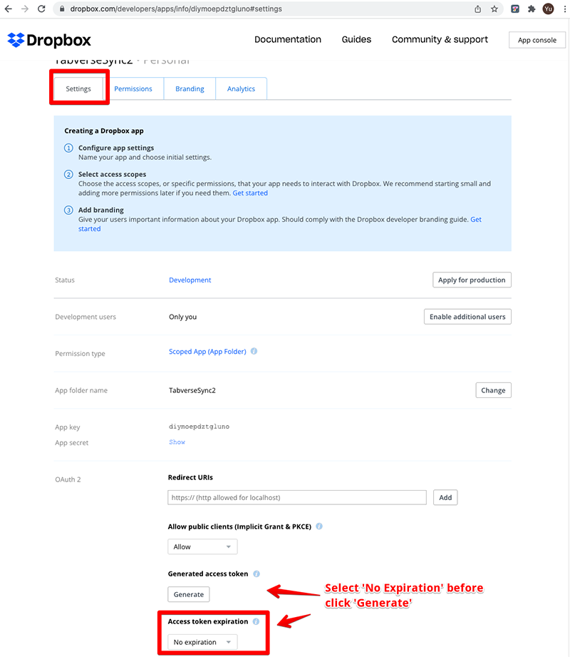

# Dropbox Backup

## Get Your Dropbox Access Token for Tabverse

For backup Tabverse to your Dropbox, you will need a Dropbox account and an
access token from your Dropbox. Following below instructions carefully to get
one and input into Tabverse. And **remember never share this access token to any person or app**.

1. go to https://www.dropbox.com, login with your Dropbox account

2. go to https://www.dropbox.com/developers/apps, click "Create app"

3. fill in information as shown in below when creating Dropbox app, then click
   "Create app"

4. after the app is created, switch to `permission` tab first, tick
   `files.content_write` and `files.content_read` permissions as shown below

5. then switch to `settings` tab, in `OAuth2` section, first to select `Access token expiration` to `No expiration`, then click `Generate access token`

6. you will find the generated access token as shown below. Select and copy it.

7. go back to tabverse, click Dropbox icon in left sidebar in bottom right,
   after you see the popup dialog, paste access token just copied in the input
   and click outside to verify. If the verified result is green, you are good to
   go to other functions like export/import.

