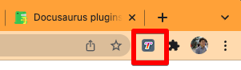
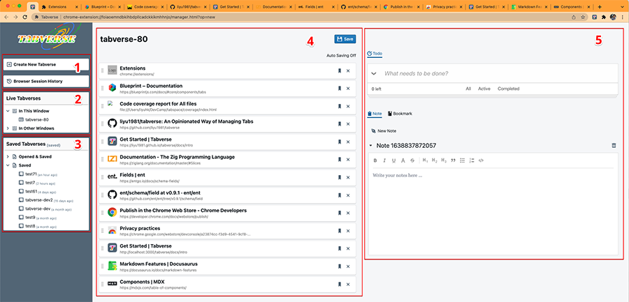

# Get Started

## What is a **Tabverse**?

When we are working on something, we usually open a chrome window and a lot of
tabs in it. Those tabs are all related the same topic. They are searches,
results, documents, online tools. We then define a **Tabverse** as the group of this
window and all its tabs, plus a managing application who can helps us to
remember tabs and making notes etc. It will help us on those tedious book
keeping work so that when we want a break from our work (or have finished our
work), we can simply close the window, but with Tabverse's help, all data is
reserved.

## Installation

Tabverse can be installed free from [Chrome Web Store](/), or [manually
installation](https://www.cnet.com/tech/services-and-software/how-to-install-chrome-extensions-manually/)
after downloading the `.crx` file from Tabverse website.

## Get Started after Installation

After install from Chrome Web Store, or manually installed by `.crx` file,
Tabverse can be started by clicking the `T` icon in chrome extension's menu.

By clicking Tabverse icon, we will then create our first Tabverse in a new tab
in current window. Below is an example of Tabverse.

Let's walk through **Tabverse** UI section by section:

- **Section 1** is for `Create New Tabverse` and `Browser Session History`.
  `Create New Tabverse` will open a new chrome window as well as a new tabverse,
  so you can start work on something new there. `Browser Session History` will
  open drawer in the right, please see [Browser Session History](/docs/session)
  for its user manual.

- **Section 2** is showing all current Tabverses. You can create multiple
  Tabverses, each of which managing the tabs in that window. This view showing
  which is in the current window, and which are in other windows. Clicking
  tabverse in other window can fast switch to it.

- **Section 3** is showing all saved Tabverses in local storage. It is sorted by
  either last update time, or created time (clicking the sub string in header to
  switch). Clicking one saved Tabverse entry will open a dialog showing its
  details as well as offering [restore options](/docs/restore).

- **Section 4** is showing the current tabs in current Window, which is managing
  by our Tabverse. You can set the name for it, choose to save it, and hovering
  on each tab entry for checking its detail and preview.

- **Section 5** are several utils to help us to do our work. They are Todos,
  Notes and Bookmarks. If you have saved your Tabverse, all your Todos, Notes
  and Bookmarks will be saved and associated to your Tabverse. Later if you
  restore one of your saved Tabverse, all associated Todos, Notes and Bookmarks
  will be restored too.
