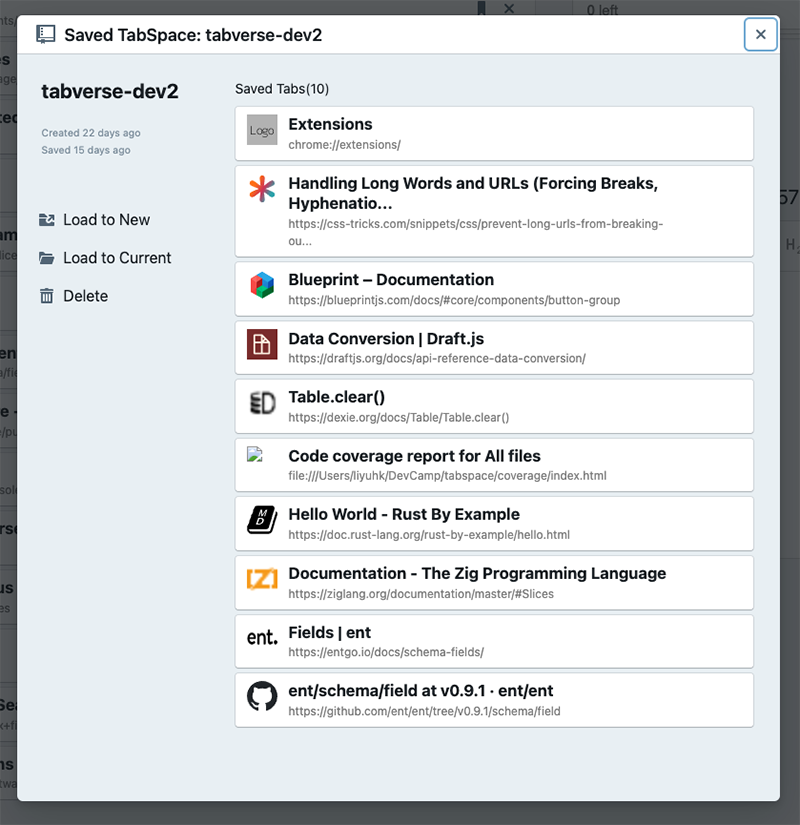

# Restore Saved Tabverse

By clicking any saved Tabverse in left panel of main Tabverse can bring up saved
Tabverse dialog as below

- **Load to New** will load this Tabverse into a new Chrome window, then open
  all saved tabs in that window.

- **Load to Current** will load this Tabverse in current Chrome window, then
  open all saved tabs in current window. **Caution** all existing tabs in
  current Chrome window will be closed, please use `Load to New` if you want to
  preserve them.

- **Delete** will delete this saved Tabverse immediately. **Caution** there will
  not be a confirm dialog again!
