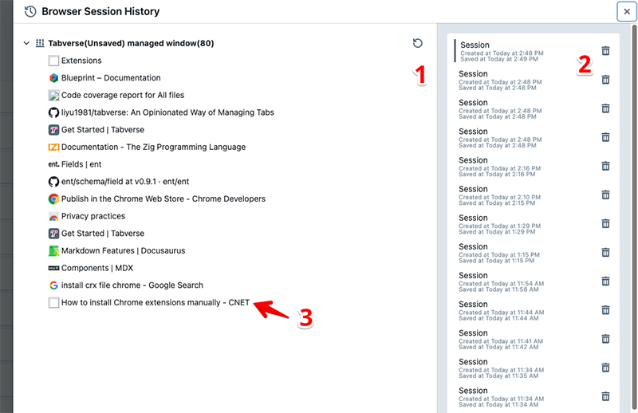

# Session History

Tabverse is configured to remember all opened tabs and windows, a.k.a, browser
session, automatically. Different from other session manager for Chrome,
Tabverse session manager is aware of Tabverse tabs.

By clicking `Browser Session History` menu in left panel in main Tabverse UI can
bring up `Session History` drawer as shown below

- Clicking restore button marked by **location 1**, will restore this window and
  all its tabs in a new Chrome window.

- Clicking session entry marked by **location 2**, will switch left detail panel
  between different sessions. Clicking the trash icon will delete this session
  from storage.

- Clicking tab entry marked by **location 3**, will restore this tab only in a
  new chrome window.
